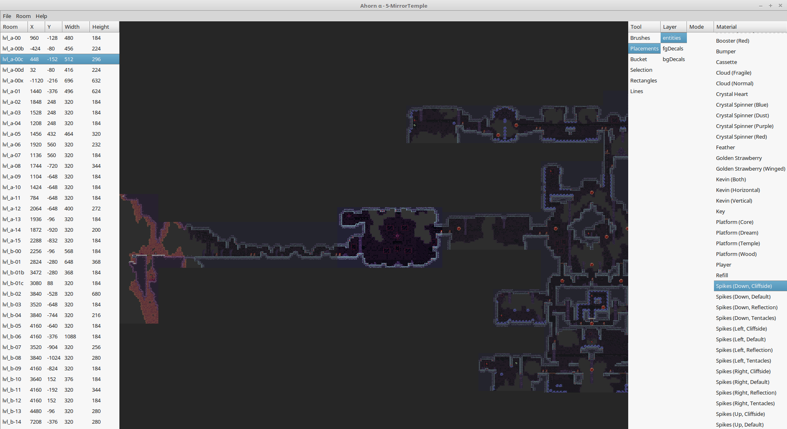
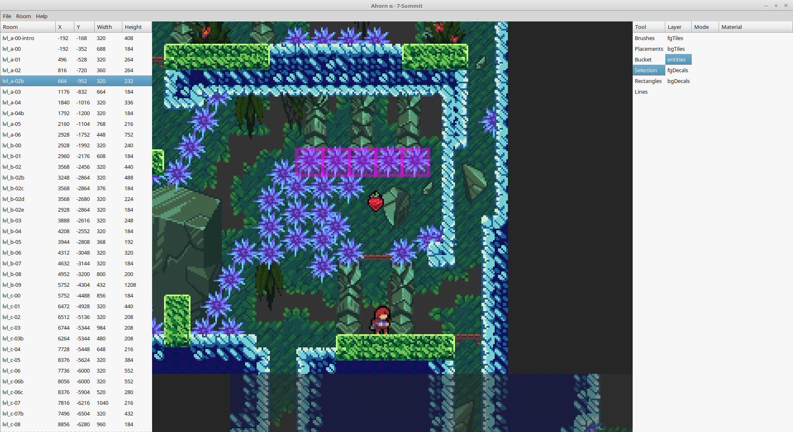

# Ahorn

[**Join us on Discord!**](https://discord.gg/Wtjf4Pb) (we're in `#map_making` on the "Mt. Celeste Climbing Association" Discord server)

Ahorn is a visual level maker and editor for the game Celeste. It allows editing map binaries, creating new ones, adding rooms, and filling the rooms with anything your heart desires (as long as what your heart desires is possible within the realms of the game). The generated map binaries can be loaded in the stock game or using [Everest](https://github.com/EverestAPI/Everest). For usage without Everest, you can replace a map in `Content/Maps` (remember backups), otherwise, you can place it in `Mods/<yourmodname>/Maps` with Everest and use the custom chapter loading. Using Everest also enables other features like instantly reloading the map using F5 or teleporting to a certain room in the game by clicking on it in Ahorn.

The program is still in an early state, some things are still missing and it is under active development. If you spot something that is missing, it will most likely be added some time in the near future. If you spot a bug or the program crashes, please report it.

Ahorn is based on [Maple](https://github.com/CelestialCartographers/Maple), a thin wrapper around the Celeste map binary format that allows you to generate maps using Julia.

This project is an unofficial map maker and level editor, it is merely a fan project aiming to aid map development until something official is available. None of this code is developed by or connected to the Celeste development team.

## Installation

### Windows installation

This installation method only works on Windows and may be slightly easier than the cross-platform one. Download [the installer and runner batch file `ahorn.bat`](https://raw.githubusercontent.com/CelestialCartographers/Ahorn/master/ahorn.bat) (Right-click the link and press "Save as...") and run it in any folder. The file will install Julia, set up Ahorn (if needed) and then launch it. Any downloaded files will temporarily be put in the folder the file was run in. Just follow its instructions.

Running `ahorn.bat` again after the installation completed will start Ahorn.

### Cross-platform manual installation

First, [install Julia if you haven't already](https://julialang.org/downloads/). You will need Julia 1.3 or later.

The easiest way to install Ahorn would be to download [the installer `install_ahorn.jl`](https://raw.githubusercontent.com/CelestialCartographers/Ahorn/master/install_ahorn.jl) (Right-click the link and press "Save as...") and run it with Julia in the terminal. Just follow its instructions. Ahorn and Maple are installed using Julia's `Pkg` system. The installer will also download and install required dependencies, so grab yourself a glass of juice while you wait.
```sh
~$ julia install_ahorn.jl
```

### First Launch

Upon launching the program for the first time, Ahorn will ask you to select the directory of your celeste installation. It needs Celeste to be installed to be able to extract textures from it, since we are not including them in the program.

The config file can be found in `%localappdata%/Ahorn` on Windows, otherwise in `~/.config/Ahorn`.

Ahorn and Maple can be updated from within Ahorn, via `Help->Check for Updates`, or like any Julia package using `Pkg.update()`. To uninstall Ahorn, run `rm Ahorn` and then `gc` in the Julia Package REPL activated to `%localappdata%/Ahorn/env` on Windows or `~/.config/Ahorn/env` otherwise.

## Usage

The possible actions in Ahorn are listed on the right, just select one to use it.
Hold right click to move around the map. Left click is your main way to place an object or select something. Tools like rectangle or line require holding left click while moving across the screen. Scroll to zoom.

Ahorn supports a couple of keybinds and special mouse functionality, with more to come. The following list might not be comprehensive.
 - Ctrl + t: New room
 - Ctrl + shift + t: Configure current room
 - Ctrl + n: New map
 - Ctrl + m: Metadata window
 - Ctrl + shift + alt + s: Open settnings window
 - q, e: shrink / grow width on selected
 - a, d: shrink / grow height on selected
 - Arrow keys: move selected
 - Left mouse button over selected: dragging selected
 - Holding ctrl + any of the above: use 1 as step size instead of 8 for more fine-grained placements
 - Shift selecting keeps previous selection as well
 - Ctrl + f: Focus search field
 - Ctrl + c: Copy selection
 - Ctrl + x: Cut selection
 - Ctrl + v: Paste selection
 - Ctrl + z: Undo changes
 - Ctrl + shift + z: Redo changes
 - Esc/Enter: Exit search field
 - v, h: vertical / horizontal mirror of decal
 - delete: delete the given node / target
 - n/+: add node to target (after the targeted node / entity)
 - Middle click: pick what's currently under the cursor in the selected layer
 - Ctrl + number key row 0-9: shortcuts to select tools
 - Alt + arrow keys: move a room
 - Alt + delete: delete room
 - Double click layer name in selection menu: toggle visibility
 - Right click entity / trigger with placements / selection tool: open properties menu
 - Double click with selections selects all similar targets
 - Holding ctrl when doing the above restricts it to targets in a more strict manner

 With Everest installed and Celeste running in debug mode, it supports some more:
 - Ctrl + alt + leftclick on a room in Ahorn: teleport to that room in the game

If you are serious about making maps, it is highly recommended to use [Everest](https://github.com/EverestAPI/Everest) for the F5 (force map reload) and F6 (open map editor for the current map) features.

If you have any question, [**ask us on `#map_making` on Discord**](https://discord.gg/Wtjf4Pb) so we may add it to this README file. Thanks for being interested in making maps for Celeste!

## Some pictures

Ahorn's main window


Close-up of a room, with a row of Crystal Spinners selected


## Frequently Asked Questions

**When will I be able to place [entity/decal/trigger/other thing in celeste]?**

Whenever we add it. Celeste has a lot of things which support for has to be individually added. This takes time, so please be patient. However, if more people complain about the lack of a particular thing, we might add it sooner.

**Why do so many things in the program have weird names?**

Most of these are the names internally used by the game, so blame the devs. Most of them do not have any official names, but we might make the names in Ahorn a bit more descriptive later on.

**Is it safe to resave maps from the base Celeste game?**

No. If something is not visible in Ahorn, it is still there in data and will be saved along with it. However, Maple is currently still unable to save 100% of the original maps back, only about 99%. As always, make backups.

**How to I make room transitions?**

A player is able to move from one room to another if the rooms are directly adjacent and there is at least one spawn point (Player entity) in each room.

**So, I made a map. What now? How do I load it?**

While you can load maps without, it is _highly_ recommended to install [Everest](https://github.com/EverestAPI/Everest). Once Everest is installed, place your map binary in `Mods/<yourmodname>/Maps` in your Celeste installtion directory. It should now be accessible from inside the game.

**Something is broken!**

That's not a question, but please report any bug you find!

**What will you do once the official map maker is out?**

Whenever that happens, we might just continue like before; it might well be that the official editor will not be quite as powerful as Ahorn tries to be. It might not ever exist. We'll see.

**Why are you writing this in Julia?**

"because it just happend" ~ @Cruor

Because it's faster than most other languages, because it is a pleasure to write in, and because we wanted to.

## License

Copyright (c) Vexatos and Cruor. All rights reserved. Refer to [LICENSE.md](LICENSE.md).